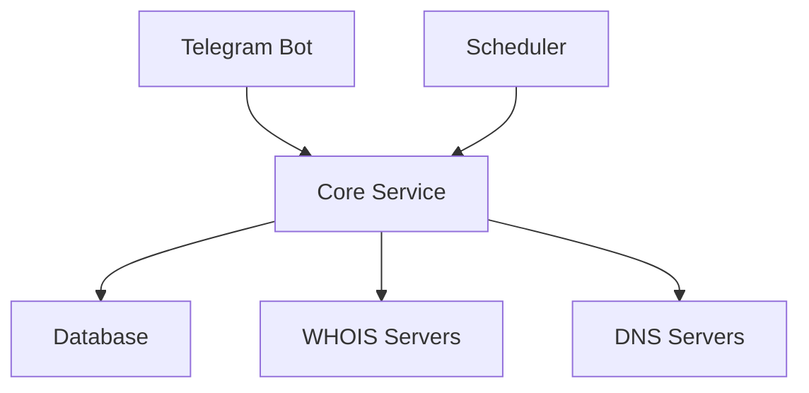

# WhoisChecker - Система мониторинга доменов через Telegram

## Цель проекта
Создание надежного и удобного Telegram-бота для автоматизированного мониторинга изменений в WHOIS и DNS-записях доменов. Система должна своевременно уведомлять пользователей об изменениях в регистрационных данных и DNS-конфигурации отслеживаемых доменов.

## Общая архитектура

### Компоненты системы
1. **Telegram Bot (Frontend)**
   - Обработка команд пользователя
   - Форматирование и отправка уведомлений
   - Управление списком отслеживаемых доменов

2. **Core Service (Backend)**
   - Асинхронный планировщик задач
   - Модуль проверки WHOIS
   - Модуль проверки DNS
   - Система сравнения и анализа изменений

3. **Database Layer**
   - Хранение данных пользователей
   - История изменений доменов
   - Конфигурация мониторинга

### Схема взаимодействия

## Основные этапы разработки

### Этап 1: Базовая инфраструктура
- [x] Выбор технологического стека
- [ ] Настройка окружения разработки
- [ ] Базовая структура проекта
- [ ] Интеграция с Telegram API

### Этап 2: Ядро системы
- [ ] Реализация WHOIS-клиента
- [ ] Реализация DNS-клиента
- [ ] Система планирования задач
- [ ] Базовая структура БД

### Этап 3: Функционал бота
- [ ] Команды управления доменами
- [ ] Система уведомлений
- [ ] Форматирование сообщений
- [ ] Базовые команды администрирования

### Этап 4: Тестирование и оптимизация
- [ ] Unit-тесты
- [ ] Интеграционные тесты
- [ ] Нагрузочное тестирование
- [ ] Оптимизация производительности

## Используемые технологии

### Основной стек
- **Python 3.11+**: Основной язык разработки
- **aiogram**: Фреймворк для Telegram бота
- **APScheduler**: Планировщик задач
- **python-whois**: Библиотека для WHOIS-запросов
- **dnspython**: Библиотека для DNS-запросов
- **SQLite/PostgreSQL**: Система хранения данных

### Инструменты разработки
- **Poetry**: Управление зависимостями
- **pytest**: Тестирование
- **black**: Форматирование кода
- **flake8**: Линтинг
- **mypy**: Статическая типизация

## Критерии качества

### Производительность
- Время ответа бота: < 2 секунды
- Интервал проверки доменов: настраиваемый (мин. 1 час)
- Максимальное количество доменов на пользователя: 50
- Максимальное количество одновременных проверок: 100

### Безопасность
- Аутентификация пользователей через Telegram
- Валидация входных данных
- Ограничение частоты запросов
- Безопасное хранение конфигурационных данных
- Логирование критических операций

### Поддерживаемость
- Модульная архитектура
- Полное покрытие тестами
- Документированный код
- Система логирования
- Мониторинг состояния сервиса

### Масштабируемость
- Асинхронная обработка запросов
- Очереди задач
- Возможность горизонтального масштабирования
- Кэширование результатов запросов 